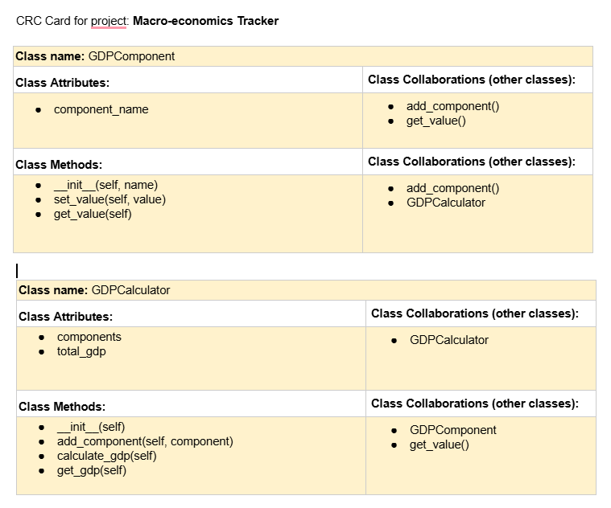

# ❗CSC226 Final Project

## Instructions

❗️Exclamation Marks ❗️indicate action items; you should remove these emoji as you complete/update the items which 
  they accompany. (This means that your final README should have no ❗️in it!)

**Author(s)**: Feda Mohammadi , Sonam Tsering 


**Google Doc Lin[README.md](README.md)k**: https://docs.google.com/document/d/1IqUFa12ckRFlhGmxh_lFLJQb1BVDFZ_NzAk2kyYhfJA/edit?usp=sharing

---

## References 
Throughout this project, you have likely used outside resources. Reference all ideas which are not your own, 
and describe how you integrated the ideas or code into your program. This includes online sources, people who have 
helped you, AI tools you've used, and any other resources that are not solely your own contribution. Update as you go.

`
#1. Classes and Objects in Python: https://www.w3schools.com/python/python_classes.asp 
#3. Why the Reset and Calculate buttons are not working on this code? It gives me this error!!.... 
#4. ChatGPT prompt: What are some ways to pull real-world GDP data from the World Bank website and implement it in this code?
#5. ChatGPT prompt: What is wbgapi and how can I use it to solve this problem?
#6. WBGAPI https://pypi.org/project/wbgapi/
#7. How to import data into Python? https://365datascience.com/tutorials/python-tutorials/import-data-python/
#8. 
`

---

## Milestone 1: Setup, Planning, Design

**Title**: `GDP Calculator`

**Purpose**: `One of the most important concepts in Macro-economics is GDP (Gross Domestic Products). This project is
 intented to calculate GDP and its components (Consumption, Investment, Government Spending, and Net Exports) 
 based on user input and displays the results graphically. We also aim to extrat real-world data from other websites to 
 rank the GDP and show the historical data on GDP of that specific country.`

**Source Assignment(s)**:
Chapter 6: Functions (to structure the program into reusable functions)
Chapter 10: Lists (to store and manipulate data)
Chapter 12: Dictionaries (to store GDP components and their values)
Chapter 15: GUI and Event Driven Programming (for the interactive user interface)
Chapter 17-19: Classes and Objects, Inheritance (to structure the GDP calculator and components as objects)
Chapter 11: Files

(We may need to add more chapters as we move forward.)


**CRC Card(s)**:
  - Create a CRC card for each class that your project will implement.
  - See this link for a sample CRC card and a template to use for your own cards (you will have to make a copy to edit):
    [CRC Card Example](https://docs.google.com/document/d/1JE_3Qmytk_JGztRqkPXWACJwciPH61VCx3idIlBCVFY/edit?usp=sharing)
  - Tables in markdown are not easy, so we suggest saving your CRC card as an image and including the image(s) in the 
    README. You can do this by saving an image in the repository and linking to it. See the sample CRC card below - 
    and REPLACE it with your own:
  
   (This crc may change as we move forward!)

**Branches**: This project will **require** effective use of git. 

Each partner should create a branch at the beginning of the project, and stay on this branch (or branches of their 
branch) as they work. When you need to bring each others branches together, do so by merging each other's branches 
into your own, following the process we've discussed in previous assignments: 

```
    Branch 1 name: mohammadif_final_project
    Branch 2 name: tserings_final_project
```
---

## Milestone 2: Code Setup and Issue Queue

Most importantly, keep your issue queue up to date, and focus on your code. 🙃

Reflect on what you’ve done so far. How’s it going? Are you feeling behind/ahead? What are you worried about? 
What has surprised you so far? Describe your general feelings. Be honest with yourself; this section is for you, not me.

```
 As of right, since we wrote the second version of the code and it works pretty well and we have the current features we
 need, we feel confident in getting this done on time. We did not yet write the test suit so that we can see which part
 of the code does not function ok, and it will be done by the next few days which will save us enough time to keep a decent 
 track of our progress. The first time when I started and was brainstorming, it seemed very hard, honestly. But now when we 
 are almost in the middle of it, it feels very good. 
 
```

---

## Milestone 3: Virtual Check-In

Indicate what percentage of the project you have left to complete and how confident you feel. 

**Completion Percentage**: `86% - 100%`

**Confidence**: Describe how confident you feel about completing this project, and why. Then, describe some 
  strategies you can employ to increase the likelihood that you'll be successful in completing this project 
  before the deadline.

```
    I personally feel very confident in compeleting this project on time because, over the past few weeks, we
    have completed the biggest chunk of code that was the main chalenge to us. I made some changes and added more
    features to it today and I believe that it will turn out well. There will be a few more changes including the 
    testing portion in the next few days. After that, we will almost be 100% done. 
    However, in any unforeseen cirsumstance, if we won't be able to complete this project online, the best strategy
    in my opinion would be to get the most of done as soon as possible, right away. In that case, we won't worry about
    the some of the biggest components that we would need to have on the application. But so far, I am confident that
    it will be completed on time. 
```

## Milestone 4: Final Code, Presentation, Demo

### User Instructions
In a paragraph, explain how to use your program. Assume the user is starting just after they hit the "Run" button 
in PyCharm. 
```
    When you run the program, a window will appear with the title "GDP Calculator." Start by reading the welcome 
    message, which explains what GDP is and its components. Below the message, you’ll see four fields where you can enter 
    the values for GDP components: "Consumption," "Investment," "Government Spending," and "Net Exports." Fill in these 
    fields with numbers (e.g., 1000, 2000). Once you have entered all the values, click the "Calculate GDP" button to see 
    the total GDP displayed just below the buttons. If you want to reset all fields and start over, click the "Reset" button. 
    After calculating the GDP, click the "See the Ranking" button to view how your GDP compares to other countries. 
    Follow these steps to calculate and rank GDP as many times as you would like.

```

### Errors and Constraints
Every program has bugs or features that had to be scrapped for time. These bugs should be tracked in the issue queue. 
You should already have a few items in here from the prior weeks. Create a new issue for any undocumented errors and 
deficiencies that remain in your code. Bugs found that aren't acknowledged in the queue will be penalized.
```
    The bugs has been tracked and listed on the queue.  
```

### Reflection
In three to four well-written paragraphs, address the following (at a minimum):
- Why did you select the project that you did?
- How closely did your final project reflect your initial design?
- What did you learn from this process?
- What was the hardest part of the final project?
- What would you do differently next time, knowing what you know now?
- (For partners) How well did you work with your partner? What made it go well? What made it challenging?

```
    I selected this project because I enjoy economics and economic data analysis, which is also my major. I have always 
    been interested in understanding how different economic components, like consumption and investment, work together 
    to calculate GDP. This project allowed me to combine my interest in economics with programming, which made it exciting 
    and meaningful. I wanted to create something practical that could help people learn more about GDP and see how their
    economic data fits into a global context.
     
    The final project is very close to what I had in mind when I first started. This program calculates GDP and ranks it
    compared to other countries, just as I planned. However, one feature I wanted but couldn’t finish is data visualization. 
    My goal was to let users see their GDP compared visually with global data, but we didn’t get to that part yet. 
    Although it’s not complete, we plan to add the visualization feature after this semester to make the project even more 
    useful and engaging. 
    
    I learned many things while working on this project. One of the biggest lessons was that it was much harder than I 
    thought it would be when I started. The coding part was challenging, especially working with classes and objects. 
    However, this also became a great learning experience as I now better understand how to use classes in a real program. 
    The process taught me to manage my expectations and appreciate how much effort goes into building even a simple application.
    
    The hardest part of this project was connecting real-world data from other sources and visualizing it. We tried to 
    fetch GDP data from external sources and clean it to use in the program, but it turned out to be very complex. 
    While we made some progress, we couldn’t fully accomplish what we wanted in this area. Data cleaning and visualization 
    require more time and effort, so we plan to continue working on this in the future.
    
    Next time, I would approach the project with a better strategy. I would break everything into smaller, more manageable 
    tasks instead of trying to tackle big chunks at once. This way, I could focus on completing one part at a time and avoid 
    feeling overwhelmed. I would also start earlier on features like data visualization and data integration, as 
    those are more time-consuming than I initially thought. Overall, this project taught me a lot, and I am excited to 
    improve it in the future.
    
    
    
    
    
    I decided to partner up with Feda and work on this project becuase we share similar majors and visions on future
     careers also good friendship, I was pleased by his origianl idea of this GDP-calclator and we agreed to work 
     together on this project.I also believe this project is a hybrid of Coding and ecnomics knowledge, plus 
     team work and communication, which will be beneficial for both of us in many way. 
     
    I think our final product is pretty much what we had in our vision from the initail discussion,we tried to set a
    realistic goal with excutable plans and there might be one or two features that we didnt' figure out but according 
    to our intial plan, I would call this final product a completion. 
    
    I learned that with a proper goal and plan, building a product will be much easier and stress-free. Also
    put what you have learned from class into actions, especially when working with someone could be very different 
    than taking tests. There will be a lot of unexpected factors and nuances during the process, the importance of 
    communication is also amplified during such experience. 
    
    For me the hardest part of this project is actually how to effectively co-operate with someone, when you have to
    consider factors like time-management, conflicts, disagreement and many more. These are usually more nuances than
    pure technical issues, and could be overlooked or ignored. but in order to make 1+1 greater or at least not smaller 
    than 2 is a very interesting yet challenging thing that made me ponder about. 
    
    By knowing what I learned from this experience, I would say systematic consistency is a good practice, also the role
     of effecitve communication can often get overlooked but it could be the inhabitor or the catalyst, so definitely 
     it is very important. 
     
    Overal, I worked well with my partner Feda, especially the part that we scheduled meeting outside of the class
    to discuss about the project and progress, also we updated each other about our own progress  when we can't meet out
    side of the class. The challenging part is that since we adopted the spliting the task stradegy, it's a bit challenging 
    to fully understand eachother's work. Espeicially when we have different views. 

```